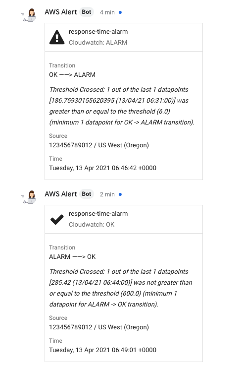

   

# Cloudwatch Alarms in Google Chat

This is an AWS Lambda function written in Go that receives alarms from AWS cloudwatch and publishes them to a Google Chat chat room.

```
Your-Service-In-AWS --> Cloudwatch Alarms --> SNS --> This-Lambda --> Google Chat
```

## Deployment using AWS SAM

Deployment uses the [AWS Serverless Application Model](https://docs.aws.amazon.com/serverless-application-model/latest/developerguide/what-is-sam.html), with the [template](./aws-serverless/template.yml) and [config](./aws-serverless/samconfig.toml) provided.

### Prerequisites

You'll need:

 - `go` installed (version 1.16 or newer)
 - [AWS SAM CLI](https://docs.aws.amazon.com/serverless-application-model/latest/developerguide/serverless-sam-cli-install.html) installed
 - AWS CLI credentials set-up

### Deploying to AWS

*The `deploy.sh` script was tested on MacOS, and should work on Linux. You may need to adjust it if you are using Windows.*

 1. Create an [SNS Topic](https://docs.aws.amazon.com/AmazonCloudWatch/latest/monitoring/US_SetupSNS.html) and configure your Cloudwatch Alarms to send notifications to it (if you have not already done so).
 2. [Create a webhook](https://developers.google.com/hangouts/chat/how-tos/webhooks#define_an_incoming_webhook) in Google Chat.
 3. Execute `./aws-serverless/deploy.sh -g` 
 4. Enter parameter values when prompted:
   - `ChatWebhookUrl` The Google Chat webhook URL.
   - `AlertImageUrl` The URL of an image to show at the top of ALARM notification messages (optional; e.g. the exclamation triangle in the screenshot below).
   - `OkImageUrl` The URL of an image to show at the top of OK notification messages (optional; e.g. the tick-mark in the screenshot below)
   - `SnsArn` The ARN of the existing SNS Topic.
   - Use the default values for the other parameters.
 
## Screenshot



